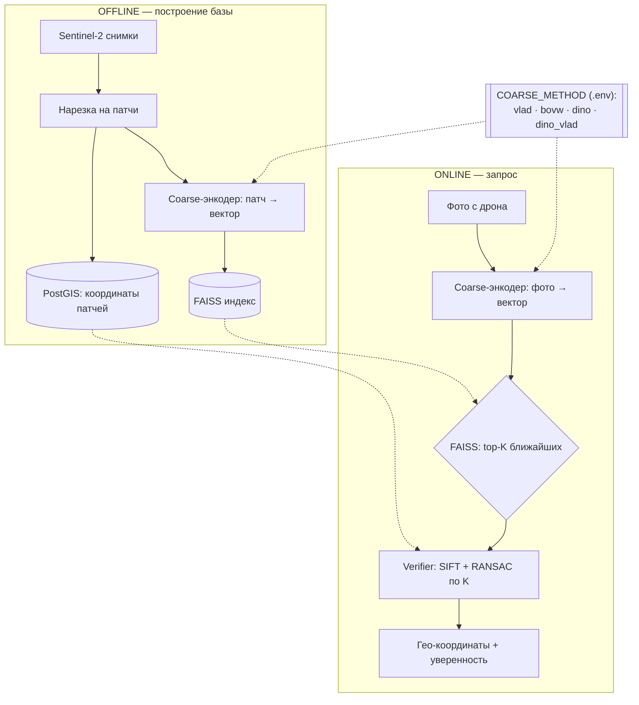
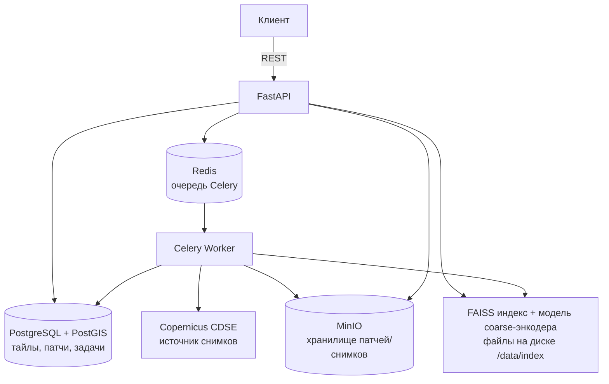

# GeoVision

Сервис геолокализации: определяет координаты места съёмки по фотографии с дрона/зонда, сопоставляя её с эталонной базой спутниковых снимков Sentinel-2.

**Вход:** фото с дрона (JPEG/PNG/TIFF)
**Выход:** top-N кандидатов координат (lat/lon) с оценкой уверенности

📖 Подробная инструкция по запуску и использованию — [`docs/SETUP.md`](docs/SETUP.md)
📄 Спецификация API — [`api.json`](api.json) (OpenAPI 3.0)

## Как это работает

Двухэтапная схема **coarse → verifier**: дешёвый глобальный дескриптор отбирает
кандидатов, дорогая геометрическая проверка подтверждает координаты. Это позволяет
искать по огромной базе (миллионы патчей), не гоняя RANSAC по всем.



### Этапы алгоритма

1. **Ingestion (offline).** Скачиваем снимки Sentinel-2 из Copernicus (CDSE) и режем
   на патчи с перекрытием; каждый патч + его гео-координаты сохраняем (MinIO + PostGIS).
2. **Coarse-энкодер (offline и online).** Превращает патч/фото в один компактный
   L2-нормированный вектор — «отпечаток места». Сменная деталь (см. ниже).
3. **FAISS-индекс.** Хранилище векторов всех патчей. На запрос отдаёт `top-K`
   ближайших по расстоянию — грубый, но быстрый отбор кандидатов.
4. **Verifier (SIFT + RANSAC).** По `K` кандидатам: сопоставление SIFT-ключевых
   точек (BFMatcher + тест Лоу) → поиск согласованной геометрии (RANSAC) →
   опционально фотометрическая проверка (NCC). Даёт итоговую привязку и уверенность.
   **Этот этап один и тот же для всех coarse-методов.**
5. **Результат.** Top-N кандидатов с координатами (lat/lon), bbox и confidence.

### Coarse-энкодеры (переключаются в `.env`)

Coarse-слой pluggable: метод выбирается настройкой `COARSE_METHOD` в `.env`, verifier
и всё остальное не меняются. Есть два семейства:
классические (кодируют **SIFT-дескрипторы** патча) и нейросетевые (кодируют **саму
картинку** через DINOv2).

| `COARSE_METHOD` | Что это | Вход | Плюсы / когда |
|---|---|---|---|
| `bovw` | Bag of Visual Words (tf-idf гистограмма) | SIFT | самый простой, слабый на больших площадях |
| `vlad` | VLAD поверх RootSIFT + PCA-whitening | SIFT | легковесный, без torch; базовый вариант |
| `dino` | DINOv2 (ViT-S/14) + pooling (`gem`/`cls`/`mean`) | картинка | семантический «отпечаток места», устойчив к domain gap; быстро строится (батчи) |
| `dino_vlad` | AnyLoc: VLAD поверх DINOv2 patch-токенов | картинка | точнее всех на больших/однородных площадях, ценой размерности вектора |

Нейро-методы (`dino`, `dino_vlad`) кодируют изображение, поэтому держат **отдельный**
FAISS-индекс (`GLOBAL_INDEX_PATH`) и требуют опциональных зависимостей `torch`/`timm`
(в образ ставятся через `ARG WITH_DINO=1` в `Dockerfile`; см. `requirements-dino.txt`).
Классические методы torch не тянут.

**Как переключить метод:**

```bash
# 1. в .env
COARSE_METHOD=dino_vlad        # bovw | vlad | dino | dino_vlad
# EXHAUSTIVE_SEARCH=false       # использовать coarse-отбор (не перебор всех патчей)

# 2. перезапустить, чтобы подхватить .env
docker-compose up -d

# 3. пересобрать индекс под новый метод и перезагрузить
curl -X POST http://localhost:8000/api/v1/admin/index/vocabulary
curl -X POST http://localhost:8000/api/v1/admin/index/build
curl -X POST http://localhost:8000/api/v1/admin/index/reload
```

Ключевые параметры нейро-методов в `.env`: `GLOBAL_MODEL_NAME`, `GLOBAL_IMAGE_SIZE`,
`GLOBAL_POOLING`, `GLOBAL_TOP_K`, `GLOBAL_INDEX_PATH`, `TORCH_NUM_THREADS`.

Сравнить методы по recall@K без пересборки боевого индекса можно харнессом
`scripts/eval_recall.py` (`--methods vlad,dino,dino_vlad`).

### Результаты тестирования

Тест на `bagaryak_query.jpg` — **сельская местность** (поля, редкая застройка).
Поиск велся по базе из **3008 патчей**, покрывающей площадь **~30 × 30 км**
(истинный патч `1488`).

> Примечание: на 1-м месте оказывается **соседний тайл** того же места
> (`patch 1441`, ~480 м — из-за перекрытия патчей), на 2-м — **нужный** тайл
> (`patch 1488`). Оба указывают на верную точку с точностью до полтайла.

**Coarse-этап** — на каком ранге метод ставит истинный патч (только глобальный
дескриптор, без RANSAC; `scripts/eval_recall.py`):

| `COARSE_METHOD` | dim | ранг истинного | R@10 | R@50 | R@300 |
|---|---|---|---|---|---|
| `vlad` (базовый) | 256 | 860 | ✗ | ✗ | ✗ (промах) |
| `dino` (GeM) | 384 | 17 | ✗ | ✓ | ✓ |
| `dino_vlad` (AnyLoc) | 12288 | **8** | ✓ | ✓ | ✓ |

**Полный пайплайн** coarse → top-300 → RANSAC — итоговый ранг после верификации:

| `COARSE_METHOD` | режим поиска | финальный ранг истинного |
|---|---|---|
| `vlad` | exhaustive (перебор всех 3008) | 2 |
| `dino` (GeM) | coarse → top-300 → RANSAC | **2** |
| `dino_vlad` (AnyLoc) | coarse → top-300 → RANSAC | **2** |

Вывод: у базового `vlad` истинный патч на coarse-этапе падает на 860-е место →
в top-300 не попадает, приходится перебирать все патчи (не масштабируется).
Нейро-методы держат его в топ-8..17 → он доходит до RANSAC через отбор top-300,
итог тот же (топ-2), но при 300 проверках вместо 3008.

## Архитектура сервиса



**Основные компоненты:**

| Компонент | Роль |
|---|---|
| `services/api` | FastAPI: приём фото, отдача результатов, админ-эндпоинты |
| `services/ingestor` | Скачивание снимков Sentinel-2 (CDSE), нарезка на патчи, загрузка в MinIO |
| `services/features` | Coarse-энкодеры (BoVW, VLAD, DINOv2, AnyLoc) + SIFT; фабрика `coarse.py` |
| `services/index` | FAISS-индекс (векторный поиск) + метаданные патчей в PostgreSQL |
| `services/matching` | Онлайн-пайплайн локализации: поиск кандидатов + RANSAC-верификация |
| `workers` | Celery-задачи: ingestion и построение индекса (долгие операции) |

## Технологии

FastAPI · OpenCV (SIFT) · DINOv2 (torch/timm, опц.) · FAISS · PostgreSQL/PostGIS · Celery + Redis · MinIO · Docker Compose

## Быстрый старт

```bash
cp .env.example .env        # заполнить CDSE credentials
docker-compose up -d
docker-compose exec api alembic upgrade head
```

Далее — ingestion снимков, построение индекса и запросы геолокализации: см. [`docs/SETUP.md`](docs/SETUP.md).
