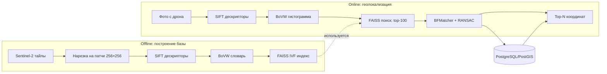
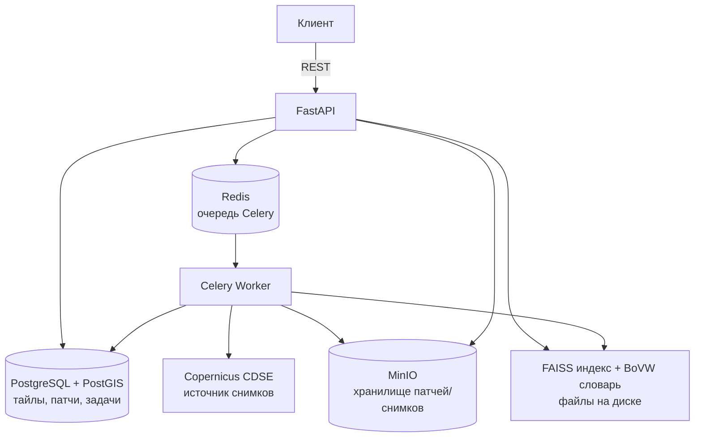

# GeoVision

Сервис геолокализации: определяет координаты места съёмки по фотографии с дрона/зонда, сопоставляя её с эталонной базой спутниковых снимков Sentinel-2.

**Вход:** фото с дрона (JPEG/PNG/TIFF)
**Выход:** top-N кандидатов координат (lat/lon) с оценкой уверенности

📖 Подробная инструкция по запуску и использованию — [`docs/SETUP.md`](docs/SETUP.md)
📄 Спецификация API — [`api.json`](api.json) (OpenAPI 3.0)

## Как это работает

Классический CV-пайплайн: SIFT-дескрипторы → Bag of Visual Words → приближённый поиск FAISS → геометрическая проверка RANSAC.



## Архитектура сервиса



**Основные компоненты:**

| Компонент | Роль |
|---|---|
| `services/api` | FastAPI: приём фото, отдача результатов, админ-эндпоинты |
| `services/ingestor` | Скачивание снимков Sentinel-2 (CDSE), нарезка на патчи, загрузка в MinIO |
| `services/features` | Извлечение SIFT-дескрипторов, обучение BoVW словаря |
| `services/index` | FAISS-индекс (векторный поиск) + метаданные патчей в PostgreSQL |
| `services/matching` | Онлайн-пайплайн локализации: поиск кандидатов + RANSAC-верификация |
| `workers` | Celery-задачи: ingestion и построение индекса (долгие операции) |

## Технологии

FastAPI · OpenCV (SIFT) · FAISS · PostgreSQL/PostGIS · Celery + Redis · MinIO · Docker Compose

## Быстрый старт

```bash
cp .env.example .env        # заполнить CDSE credentials
docker-compose up -d
docker-compose exec api alembic upgrade head
```

Далее — ingestion снимков, построение индекса и запросы геолокализации: см. [`docs/SETUP.md`](docs/SETUP.md).
